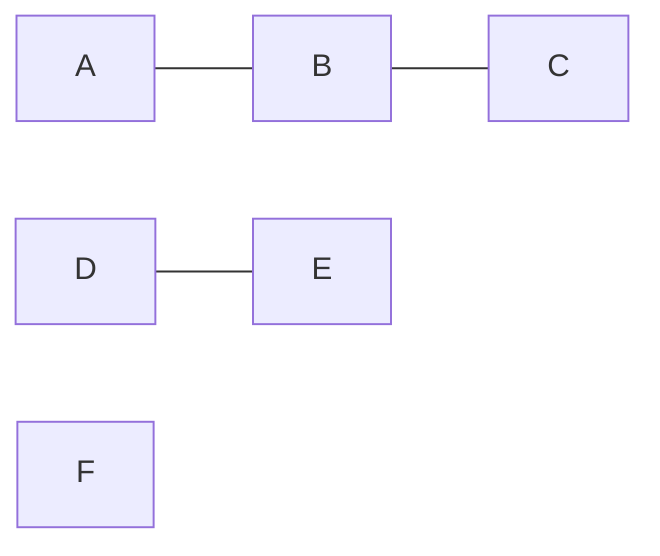
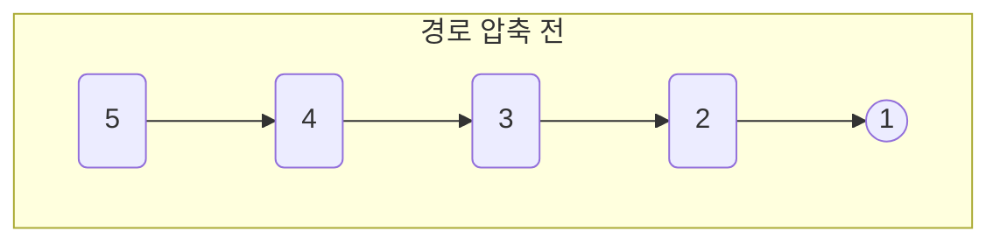
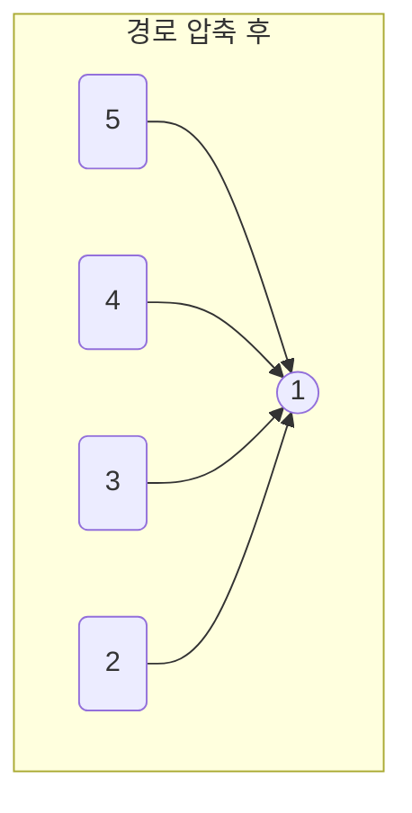

# Union-Find (유니온 파인드)

> 이번 시간에는 'Union-Find' 이라는 유형의 알고리즘을 살펴보겠습니다. 사실 단어 뜻만 봐서는 이게 뭘 표현하려고 하는 건지 잘 와닿지 않습니다. 합치고 찾는다.. 단순하게 설명하면, 두 원소가 서로 같은 집합에 속하는지 빠르게 알아내기 위해서 Find와 Union 연산을 수행해서 문제를 해결하는 방법론입니다. 개념을 훑어보고, 문제를 살펴보면서 이해해봅시다.

## 어떤 문제를 해결할 수 있을까요?

아래는 정점과 간선을 포함한 무방향 그래프입니다.

### 무방향 그래프 예시


예를 들어 다음과 같은 상황을 가정해 봅시다. 무방향 그래프 상에 여러 정점들이 존재하고, 해당 정점들 사이에 존재하는 간선 정보가 주어졌습니다. 어떤 정점에서 다른 정점으로 이동할 수 있는 경로가 존재하는지 어떻게 빠르게 알 수 있을까요? 

- A는 B를 통해 C와 연결돼 있으므로, (A, B, C)는 하나의 그룹(집합)입니다.

- D와 E는 서로 연결되어 있으므로, (D, E)는 또 다른 그룹입니다.

- F는 어떤 정점과도 연결되어 있지 않습니다.

그룹으로 분할한 후 같은 그룹에 속하면 이동 가능하다고 해석할 수 있습니다. 그러나 이 과정은 그래프가 간단할 때는 직관적으로 보이지만, 그래프 구조가 복잡해지면 Brute-Force로는 빠르게 알기 어렵습니다. 

필요한 집합 단위 연산을 적용할 때 단순히 DP만 적용하면 그룹이 합쳐질 때마다 그룹에 속한 모든 노드를 수정해야 합니다. 이보다는 그룹의 대표 노드를 정하고 이 대표노드, 즉 루트 노드만 수정하는 것이 이상적이겠죠. 이 방식을 Union과 Find연산을 통해 구현합니다.

## Disjoint Set (서로소 집합)

- 직역하면 '서로소 집합 자료구조'입니다. Union-Find 문제를 해결하기 위해 사용하는 자료구조 입니다.

- parent, nodeRank 배열을 일반적으로 사용해서 구현합니다. parent[i]는 원소 i의 부모 원소를 나타내고, nodeRank[i]는 원소 i가 속한 집단의 루트 노드를 기준으로 트리를 구성했을 때 해당 트리의 높이를 나타냅니다. nodeRank에 대해서는 union연산을 소개하면서 설명하겠습니다.

### Find 연산

- 특정 원소의 대표 원소(루트)를 찾기 위한 연산입니다.

```java
int findRoot(int x){
    // x가 루트일 경우, x를 반환
    if(parent[x] == x) return x;

    // x가 루트가 아닐 경우, findRoot를 재귀적으로 호출
    return findRoot(parent[x]);
}
```

구현은 간단합니다. x가 루트면 그대로 x를, 그렇지 않다면 재귀적으로 호출해서 x가 속한 집단의 최상위 루트 노드를 탐색하는 구조입니다.

#### 경로 압축 적용

위의 findRoot는 다음과 같은 상황에서 비효율적입니다.


만약 findRoot(5)를 수행할 경우, findRoot(5) -> findRoot(4) -> findRoot(3) -> findRoot(2) -> findRoot(1)까지 총 5번 연산을 수행하게 됩니다. 

findRoot(i)를 수행할 때마다 i의 depth만큼 findRoot가 호출되는 것이죠. 이를 더 효율적으로 수행할 수 있는 방법이 없을까요? 다음처럼 DP를 응용해서 parent 배열을 업데이트하면 이를 크게 개선할 수 있습니다.

- 경로 압축을 적용한 findRoot
```java
int findRoot(int x){
    if(parent[x] == x) return x;

    parent[x] = findRoot(parent[x]);

    return parent[x];
}
```
위 코드는 findRoot(parent[x])의 결과를 다시 parent[x]에 저장하는 방식으로 노드의 depth를 업데이트 합니다. 따라서 findRoot(5), findRoot(4), findRoot(3)을 수행한다면 트리 구조가 다음과 같이 갱신됩니다.



경로 압축 기법을 적용하면 findRoot 연산의 시간복잡도를 거의 O(1)로 낮출 수 있습니다.

### Union 연산

> Union by Rank 최적화를 적용합니다.
```java
void unionRoot(int x, int y) {
    x = findRoot(x);
    y = findRoot(y);

    if(x != y) {
        if(nodeRank[x] < nodeRank[y]){
            parent[x] = y;
        }
        else if(nodeRank[y] < nodeRank[x]){
            parent[y] = x;
        }
        else{
            parent[y] = x;
            nodeRank[x] += 1;
        }
    }
}
```

Union 연산도 의외로 코드는 간단합니다. 두 노드 x, y의 루트 노드를 탐색하고, 같은 그룹(집합)에 속하는지 비교합니다. 다른 그룹일 경우 병합을 수행하는데, 이 때 nodeRank를 비교합니다. 트리의 높이를 최대한 줄이기 위해서 nodeRank가 더 큰 그룹쪽에 병합합니다.

예를 들어, 그룹 1이 2 → 1, 그룹 2가 5 → 4 → 3이라고 할 때, parent[1] = 3으로 설정해 그룹 1을 그룹 2 아래로 병합하면, 그룹 2의 nodeRank는 그대로 3으로 유지됩니다.

nodeRank가 같다면 아무 쪽에 병합해도 상관없습니다. 대신, 병합 시 트리 높이가 1 증가하니 맞춰서 nodeRank도 1 증가시켜줘야 합니다.

## 백준 1717 - 집합의 표현

- Union-Find 유형의 대표문제를 풀어봅시다!

[백준 1717 - 집합의 표현](https://www.acmicpc.net/problem/1717)

### findRoot, parent 초기화

```java
nodeRank = new int[n + 1];
parent = new int[n + 1];

for (int i = 0; i <= n; i++) {
    nodeRank[i] = 1;
    parent[i] = i;
}
```
초기에는 집합의 원소가 하나이므로 nodeRank는 모두 1로 설정하고, parent값은 자기자신으로 설정합니다.

이후 findRoot, unionRoot연산을 차례로 구현해서 문제 조건에 맞게 풀이합니다.

### 풀이

> 전체 코드
```java
import java.io.*;
import java.util.StringTokenizer;

public class Main {
    static BufferedReader br = new BufferedReader(new InputStreamReader(System.in));
    static BufferedWriter bw = new BufferedWriter(new OutputStreamWriter(System.out));

    int n, m;
    int[] nodeRank;
    int[] parent;

    public static void main(String[] args) throws IOException {
        new Main().solve();

        br.close();
        bw.close();
    }

    void solve() throws IOException {
        getInput();

        StringTokenizer st;

        for(int i = 0; i < m; i++){
            st = new StringTokenizer(br.readLine());

            int op = Integer.parseInt(st.nextToken());
            int a = Integer.parseInt(st.nextToken());
            int b = Integer.parseInt(st.nextToken());

            if (op == 0) {
                unionRoot(a, b);
            }
            else {
                if (findRoot(a) == findRoot(b)) {
                    bw.write("YES\n");
                }
                else {
                    bw.write("NO\n");
                }
            }
        }
    }

    void getInput() throws IOException {
        StringTokenizer st = new StringTokenizer(br.readLine());

        n = Integer.parseInt(st.nextToken());
        m = Integer.parseInt(st.nextToken());

        nodeRank = new int[n + 1];
        parent = new int[n + 1];

        for (int i = 0; i <= n; i++) {
            nodeRank[i] = 1;
            parent[i] = i;
        }
    }

    int findRoot(int x) {
        if(x == parent[x]) return x;

        parent[x] = findRoot(parent[x]);

        return parent[x];
    }

    void unionRoot(int x, int y) {
        x = findRoot(x);
        y = findRoot(y);

        if (x != y) {
            if (nodeRank[x] < nodeRank[y]) {
                parent[x] = y;
            }
            else if (nodeRank[y] < nodeRank[x]) {
                parent[y] = x;
            }
            else {
                parent[y] = x;
                nodeRank[x] += 1;
            }
        }
    }
}
```

## 요약

> 경로 압축, Union By Rank 최적화를 적용한 Union-Find 알고리즘을 사용하면 집합을 병합하는 과정의 시간복잡도를 거의 O(1)에 가깝게 수행할 수 있습니다.

또한 조금만 응용하면 다음과 같은 상황에서도 적용해 볼 수 있는 좋은 알고리즘이기에 Union, Find 연산 코드를 템플릿화해서 사용하면 유용하게 사용 가능합니다.

- 최소 신장 트리 (MST): 크루스칼 알고리즘에서 사이클 생성 여부를 확인할 때

- 네트워크 연결: 두 컴퓨터가 같은 네트워크 상에 있는지 확인할 때

- 그래프의 사이클 판별